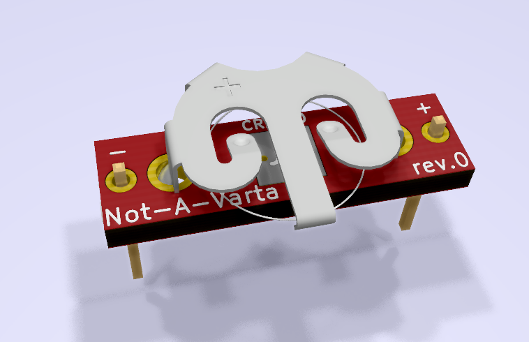

# Not-A-Varta
A standard 19mm length Varta replacement with a CR1220 and charge protection.

## Info
This is a battery replacement for old circuit boards utilizing the 19mm length 3.6V Varta battery. The replacement is a 3V CR1220 with charge circuit protection. Low voltage drop is achieved with the MAX40200 "ideal diode" chip. Most boards will work with RTC/CMOS function at 3V, so check datasheets before you go through the hassle of building and installing this. Clean up any corrosion from the pre-existing evil Varta before installation.
\
\
Open hardware design. Do what you want with it.
